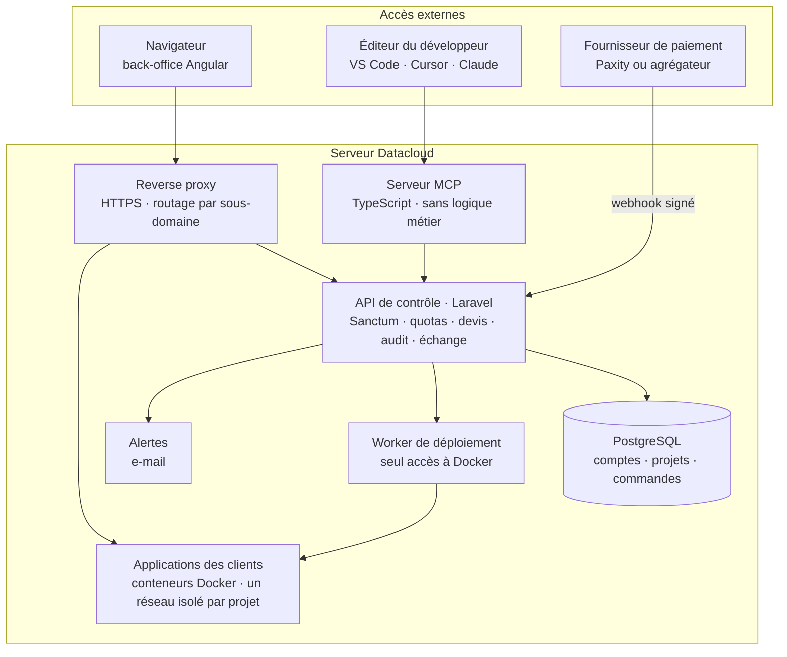

# SamaCloud

> **Partagez votre stack, déployez-la en un message.**

SamaCloud est la plateforme d'échange et de déploiement des développeurs africains.
Elle permet de **déployer, payer, surveiller et gérer** ses projets sur l'infrastructure
Datacloud de Systalink — depuis son éditeur grâce à l'IA, ou depuis un back-office web —
et d'**échanger** avec les autres développeurs templates, composants et solutions aux pannes.

Projet présenté au concours **CADEV de Systalink** sur le thème
« Construire la plateforme d'échange africaine, pour les devs, par les devs ».

> 🚧 **Projet en cours de développement.** Les sections marquées *(à venir)* seront
> complétées prochainement.

---

## Sommaire

- [Le problème](#le-problème)
- [La solution](#la-solution)
- [Fonctionnalités](#fonctionnalités)
- [Architecture](#architecture)
- [Stack technique](#stack-technique)
- [Le serveur MCP : l'IA dans l'éditeur](#le-serveur-mcp--lia-dans-léditeur)
- [Le fichier datacloud.yaml](#le-fichier-datacloudyaml)
- [Commande et paiement](#commande-et-paiement)
- [Sécurité](#sécurité)
- [Structure du dépôt](#structure-du-dépôt)
- [Installation](#installation)
- [Compte de démonstration](#compte-de-démonstration)
- [Documentation](#documentation)
- [Équipe](#équipe)
- [Limites assumées](#limites-assumées)
- [Feuille de route](#feuille-de-route)
- [Conformité au règlement](#conformité-au-règlement)

---

## Le problème

Pour mettre un projet en ligne, un développeur africain doit aujourd'hui :

- **configurer seul un serveur nu**, sans aide ;
- ou **payer un service étranger en devises**, avec une carte bancaire internationale
  qu'il n'a souvent pas.

Chacun refait seul les mêmes configurations, rencontre les mêmes pannes, et son talent
reste peu visible.

## La solution

**La simplicité d'un service comme Vercel, payable en FCFA par mobile money, sur une
infrastructure locale, avec une communauté qui partage et se fait connaître par son
travail.**

Cible : étudiants (projet de fin d'études), freelances (démo pour un client) et
développeurs indépendants (projet personnel, portfolio) d'Afrique francophone.

---

## Fonctionnalités

SamaCloud repose sur six modules branchés sur une même API de contrôle, seule source de
vérité du système.

| Module | Rôle |
|---|---|
| **Moteur de déploiement** | Applications et bases de données à partir du catalogue, déploiement depuis Git ou depuis un template, sous-domaine et certificat SSL, réseau isolé par projet, quotas |
| **Commande et paiement** | Catalogue, devis en FCFA, lien de paiement de 15 minutes, réservation de capacité, confirmation par webhook, crédits et renouvellements |
| **Back-office client** | Interface web pensée d'abord pour mobile : projets, monitoring, logs, déploiements, journal d'audit, commandes et échéances |
| **Serveur MCP** | Le développeur pilote la plateforme en langage naturel depuis VS Code, Cursor ou Claude — **fonctionnalité phare** |
| **Couche d'échange** | Templates et composants partagés, pannes résolues, étoiles, classement, profils publics |
| **Console d'administration** | Catalogue et tarifs, capacité, crédits, suspension des comptes abusifs |

> **Principe directeur** : le back-office et le serveur MCP sont deux façades sur le même
> cerveau. Une action faite par l'IA apparaît immédiatement dans le back-office, et une
> métrique affichée dans le back-office est exactement celle que l'IA lit pour faire un
> diagnostic.

### Couche d'échange : « par les devs, pour les devs »

| Brique | Ce qu'elle fait |
|---|---|
| Templates et composants | Un développeur publie sa stack (`datacloud.yaml`, README, captures). Bouton « Déployer ce template » |
| Pannes résolues | Après un auto-diagnostic réussi, l'IA propose de partager l'incident anonymisé : symptôme, cause, correctif |
| Étoiles | Les développeurs récompensent les contenus qui les ont aidés |
| Classement *(bêta)* | Meilleurs développeurs par pays : étoile reçue +5, déploiement d'un de ses templates +2, développeur aidé +2, contenu publié +10 |
| Profil public | Vitrine qui ouvre des opportunités : missions freelance, emplois, collaborations |

---

## Architecture

Tout tourne sur le serveur Datacloud. L'API Laravel est le **seul point d'entrée**, que
l'on passe par le navigateur ou par l'IA.



- Le trafic des applications déployées entre par le reverse proxy.
- Le back-office et le serveur MCP appellent l'API avec le jeton du client.
- Seul le worker de déploiement pilote Docker.
- Les bases de données des clients ne sont jamais exposées sur internet.

**Principes** : opérations longues asynchrones avec suivi d'avancement ; actions
idempotentes ; adaptateur de paiement interchangeable ; couche d'adaptation pour brancher
l'API officielle Datacloud ; architecture volontairement lisible pour que chaque membre
puisse l'expliquer.

---

## Stack technique

| Couche | Technologie |
|---|---|
| Back-office et échange | Angular (TypeScript), client généré depuis l'OpenAPI |
| API de contrôle | Laravel, Sanctum, files Laravel |
| Serveur MCP | TypeScript, SDK MCP officiel |
| Données | PostgreSQL |
| Exécution | Docker, reverse proxy (Caddy ou Traefik), DNS générique |
| Qualité | Pest, build Angular, CI, contrôle des licences |

---

## Le serveur MCP : l'IA dans l'éditeur

Le serveur MCP traduit les demandes de l'IA en appels à l'API Laravel, **sans logique
métier**. Le développeur l'ajoute à son éditeur avec son jeton personnel.

### Exemple

```text
Développeur : « Déploie mon blog Laravel avec une petite base PostgreSQL. »

IA : J'ai analysé le dépôt : Laravel 11, PHP 8.3, PostgreSQL.
     Plan proposé :
       • service web, taille petite
       • base PostgreSQL, taille petite
     Coût : 30 jours, calculé par l'API.
     Je crée la commande ?

Développeur : « Oui. »

IA : Voici votre lien de paiement, valable 15 minutes : https://…
     … paiement confirmé, déploiement en cours …
     Votre blog est en ligne : https://mon-blog.<domaine>
```

### Fonctionnalités clés

- **Analyse du dépôt** : framework, version du langage, dépendances, ressources adaptées.
- **Mode plan/apply** : un plan lisible avec son coût, aucune exécution avant validation.
- **Auto-diagnostic** : en cas d'échec, lecture des logs, recherche dans les incidents
  partagés, explication, correctif proposé, redéploiement après validation.
- **Partage** : après une résolution, l'IA propose de publier l'incident anonymisé.
- **Ancrage local** : prix en FCFA, échanges en français.

### Outils par niveau de risque

| Niveau | Outils | Règle |
|---|---|---|
| Lecture | `analyser_depot`, `lister_projets`, `etat_projet`, `lire_logs`, `lire_metriques`, `lister_deploiements`, `suivre_operation`, `consulter_catalogue`, `lister_commandes`, `lire_journal_audit`, `planifier_deploiement`, `chercher_incidents`, `chercher_templates` | Exécution libre |
| Écriture réversible | `creer_commande`, `regenerer_lien_paiement`, `preparer_renouvellement`, `redeployer`, `modifier_variables`, `publier_template`, `publier_incident` | Résumé des changements, puis validation |
| Destructive | `supprimer_projet`, `supprimer_base` | Le développeur tape le nom du projet |
| Paiement | *aucun outil* | L'IA génère un lien, seul un humain paie |

Détail des paramètres et des endpoints : [`outils-mcp.md`](outils-mcp.md).

### Brancher le serveur MCP *(à venir)*

1. Dans le back-office, page **Accès IA** → **Créer un jeton pour l'IA**.
2. Ajouter le serveur à votre éditeur :

**Claude Code**

```bash
claude mcp add samacloud --env SAMACLOUD_TOKEN=<votre-jeton> -- npx -y @samacloud/mcp
```

**VS Code** — `.vscode/mcp.json`

```json
{
  "servers": {
    "samacloud": {
      "command": "npx",
      "args": ["-y", "@samacloud/mcp"],
      "env": { "SAMACLOUD_TOKEN": "${input:samacloud-token}" }
    }
  },
  "inputs": [
    { "id": "samacloud-token", "type": "promptString", "description": "Jeton SamaCloud", "password": true }
  ]
}
```

**Cursor** — `.cursor/mcp.json`

```json
{
  "mcpServers": {
    "samacloud": {
      "command": "npx",
      "args": ["-y", "@samacloud/mcp"],
      "env": { "SAMACLOUD_TOKEN": "<votre-jeton>" }
    }
  }
}
```

> Le nom du paquet `@samacloud/mcp` est provisoire.

---

## Le fichier datacloud.yaml

Placé à la racine du dépôt d'un projet, `datacloud.yaml` décrit ce dont il a besoin pour
tourner : services, framework, taille, commandes, bases de données et variables attendues.
Il rend l'infrastructure reproductible, et c'est l'objet que les développeurs
s'échangent sous forme de templates.

Il est **facultatif** : sans fichier, SamaCloud détecte le framework ; l'IA peut aussi le
rédiger. Il ne contient **jamais de secret**.

```yaml
version: 1
nom: mon-blog

services:
  web:
    framework: laravel
    taille: petite
    release: php artisan migrate --force
    sante:
      chemin: /up
    bases: [principale]
    variables:
      APP_ENV: production
      APP_KEY: { generer: laravel-app-key }
      MAIL_PASSWORD: { secret: true, description: "Mot de passe SMTP" }

bases:
  principale:
    type: postgresql
    taille: petite
```

Spécification complète : [`datacloud-yaml.md`](datacloud-yaml.md) ·
Schéma de validation : [`datacloud.schema.json`](datacloud.schema.json).

---

## Commande et paiement

Le paiement intervient **avant** le provisionnement. Un paiement couvre les ressources
commandées pour **30 jours**, avec redéploiements illimités.

1. Le développeur décrit son projet, via l'IA ou le back-office.
2. L'API calcule le devis à partir de la grille tarifaire — **jamais l'IA**.
3. Le développeur valide ou ajuste le devis.
4. L'API génère un **lien de paiement valable 15 minutes** et réserve la capacité.
5. Le fournisseur de paiement confirme par **webhook signé**.
6. Le provisionnement démarre et l'URL est communiquée.

**Règles** : chaque webhook est vérifié et traité une seule fois ; un paiement tardif est
honoré si la capacité est disponible, sinon crédité — l'argent n'est jamais conservé sans
livraison ; un lien expiré peut être régénéré avec un devis recalculé.

**Fournisseurs** : Paxity en priorité (écosystème Systalink), sous réserve d'accès ; un
agrégateur (PayDunya, CinetPay, Hub2) en secours ; un **mode test simulé** pour le jury.

---

## Sécurité

| Rôle | Périmètre |
|---|---|
| Client | Tous les droits sur ses propres projets ; actions destructives soumises à confirmation |
| Administrateur Systalink | Catalogue et tarifs, capacité, crédits et remboursements, suspension des comptes abusifs |
| Agent IA | Agit au nom du client avec son jeton, bridé : confirmation avant toute action destructive, plafond de dépense mensuel, chaque action marquée « IA » dans le journal d'audit |

- Jetons d'accès à portée limitée (Sanctum), révocables, affichés une seule fois.
- **Protection contre l'injection de prompt** : logs, fichiers et incidents lus par l'IA
  sont des données, jamais des instructions.
- Secrets générés par l'API, stockés chiffrés, absents des logs et des templates publiés.
- Docker accessible uniquement au worker de déploiement ; seul le reverse proxy est
  exposé sur internet.
- Quotas par compte et plafond de mémoire par conteneur.
- **L'IA ne paie jamais** : elle génère un lien, un humain valide.
- Opérations longues asynchrones et actions idempotentes.

---

## Structure du dépôt

État actuel :

```text
.
├── README.md
├── Cahier des charges — SamaCloud.pdf
├── outils-mcp.md            # outils du serveur MCP, authentification, endpoints requis
├── datacloud-yaml.md        # spécification du format datacloud.yaml
└── datacloud.schema.json    # schéma JSON de validation de datacloud.yaml
```

Organisation prévue *(à venir)* :

```text
.
├── api/        # API de contrôle Laravel
├── front/      # back-office et couche d'échange Angular
├── mcp/        # serveur MCP TypeScript
├── infra/      # configuration Docker, reverse proxy, scripts serveur
└── docs/       # cahier des charges, spécifications, OpenAPI, déclarations
```

---

## Installation

*(à venir)*

Prérequis prévus : PHP 8.3, Composer, Node.js 22, PostgreSQL 16, Docker.

---

## Compte de démonstration

*(à venir)* — Les identifiants du compte de test seront affichés sur la page d'accueil de
la plateforme. Le compte de démonstration est limité (quotas réduits, paiement simulé) et
arrive sur une plateforme vivante : projets en ligne, graphiques remplis, un déploiement
échoué puis corrigé par l'IA, une commande payée, des templates et incidents publiés.

---

## Documentation

| Document | Contenu |
|---|---|
| [Cahier des charges](Cahier%20des%20charges%20—%20SamaCloud.pdf) | Contexte, modules, architecture, règles de gestion |
| [`outils-mcp.md`](outils-mcp.md) | Outils MCP par niveau de risque, ressources, prompts, authentification, endpoints requis |
| [`datacloud-yaml.md`](datacloud-yaml.md) | Spécification du format `datacloud.yaml` |
| [`datacloud.schema.json`](datacloud.schema.json) | Schéma JSON de validation |
| Spécification OpenAPI | *(à venir)* |

---

## Équipe

| Membre | Module |
|---|---|
| Thioro Faye | Front Angular (back-office et échange) |
| Moussa Ndao | API Laravel |
| Souleymane Ndao | Moteur de déploiement |
| Serigne Abdoulaye Babou | Serveur MCP (TypeScript) |
| Amadou Deme | Paiement, administration et qualité |

---

## Limites assumées

- Le prototype tourne sur **une seule machine**, sans haute disponibilité.
- Les conteneurs partagent le noyau de la machine.
- En l'absence d'API officielle Datacloud confirmée, la plateforme s'appuie sur un
  mini-cloud construit sur le serveur Datacloud. Son API est présentée comme une
  **proposition d'API pour Datacloud**, jamais comme l'API officielle de Systalink.
- Les fonctionnalités en bêta sont étiquetées comme telles dans l'interface.

## Feuille de route

- Offres équipe, agence et entreprise avec comptes multi-utilisateurs
- Missions et appels à collaboration publiés par les entreprises sur les profils publics
- Durées de paiement au choix (1, 3 ou 12 mois) et offre d'essai
- Inscription par numéro de téléphone, alertes par SMS et WhatsApp
- Serveur MCP hébergé avec connexion OAuth (plus de jeton à copier)
- Intégration du paiement mobile money (Paxity) dans les applications déployées
- Branchement sur l'API officielle Datacloud et le back-office Systalink
- Répartition sur plusieurs machines et isolation renforcée

---

## Conformité au règlement

- **Licences** : liste des composants et de leurs licences générée automatiquement
  (`composer licenses`, `license-checker`) et vérifiée en CI. Briques principales sous
  licence permissive : Laravel, Angular (MIT), Docker, Caddy (Apache 2.0), PostgreSQL.
  Toute dépendance GPL, AGPL ou LGPL est écartée ou soumise aux organisateurs.
- **Usage de l'IA** : journal tenu dès le début. La conception de l'architecture, du
  modèle de paiement, du cahier des charges et des spécifications a été réalisée avec
  l'aide de Claude (Anthropic). Tout code produit avec l'IA est relu, compris et
  explicable par chaque membre.
- **Titularité et antériorité** : déclaration de chaque membre ; déclaration de tout
  code antérieur réutilisé.

*(Déclarations détaillées à venir.)*
