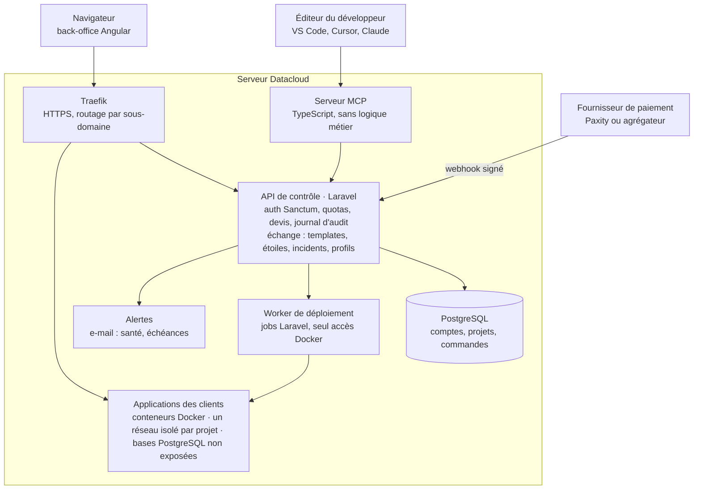
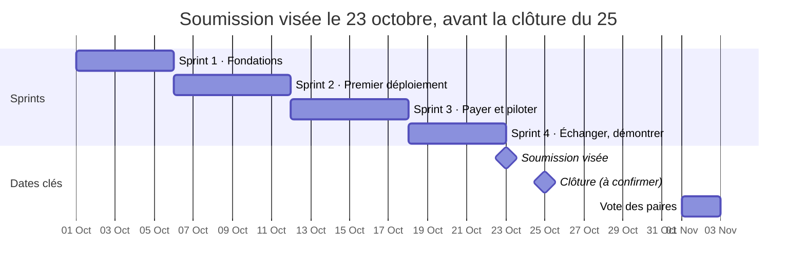

# Cahier des charges — SamaCloud

2 octobre 2026 · @Souleymane — mis à jour le 3 octobre 2026 (reverse proxy : Traefik)

## Contexte, objectif et cible

SamaCloud est la plateforme d'échange et de déploiement des développeurs africains,
présentée au concours CADEV de Systalink sur le thème « Construire la plateforme
d'échange africaine, pour les devs, par les devs ».

**Objectif.** Permettre aux développeurs de déployer, payer, surveiller et gérer leurs projets
sur l'infrastructure Datacloud de Systalink, depuis leur éditeur grâce à l'IA ou depuis un
back-office web, et d'échanger entre eux templates, composants et solutions aux pannes.

**Problème.** Pour mettre un projet en ligne, un développeur doit configurer seul un serveur
nu, ou payer un service étranger en devises avec une carte bancaire internationale qu'il
n'a souvent pas. Chacun refait seul les mêmes configurations, rencontre les mêmes
pannes, et son talent reste peu visible.

**Cible.** La formule personnelle : étudiants (projet de fin d'études), freelances (démo pour
un client), développeurs indépendants (projet personnel, portfolio) d'Afrique
francophone. Les offres équipe, agence et entreprise sont dans la feuille de route.

**Positionnement.** La simplicité d'un service comme Vercel, payable en FCFA par mobile
money, sur une infrastructure locale, avec une communauté qui partage et se fait
connaître par son travail.

**Slogan :** « Partagez votre stack, déployez-la en un message. »

## Concept général

Six modules reposent sur une même API de contrôle, seule source de vérité du système.

| Module | Rôle |
|---|---|
| Moteur de déploiement | Provisionne applications et bases de données, déploie depuis Git, gère le routage, les certificats SSL, l'isolation des projets et les quotas |
| Commande et paiement | Catalogue, devis, liens de paiement de 15 minutes, réservation de capacité, confirmation par webhook, crédits et renouvellements |
| Back-office client | Interface web pensée d'abord pour mobile : projets, monitoring, logs, déploiements, journal d'audit, commandes et échéances. Vitrine pour le jury |
| Serveur MCP | Le développeur pilote la plateforme en langage naturel depuis VS Code, Cursor ou Claude. Fonctionnalité phare |
| Couche d'échange | Templates et composants partagés, pannes résolues, étoiles, classement, profils publics qui ouvrent des opportunités |
| Console d'administration | Catalogue et tarifs, capacité, crédits, suspension des comptes abusifs |

**Principe directeur :** le back-office et le serveur MCP sont deux façades sur le même
cerveau. Une action faite par l'IA apparaît immédiatement dans le back-office, et une
métrique affichée dans le back-office est exactement celle que l'IA lit pour faire un
diagnostic.

## Architecture technique

Tout tourne sur le serveur Datacloud acheté avec le code promo ; l'API Laravel est le seul
point d'entrée, que l'on passe par le navigateur ou par l'IA.

*Architecture · 3 accès externes, 6 composants sur le serveur.*

Le trafic des applications déployées entre par Traefik ; le back-office et le serveur MCP
appellent l'API avec le jeton du client ; seul le worker de déploiement pilote Docker.

| Couche | Technologie |
|---|---|
| Back-office et échange | Angular (TypeScript), client généré depuis l'OpenAPI |
| API de contrôle | Laravel, Sanctum, files Laravel |
| Serveur MCP | TypeScript, SDK MCP officiel |
| Données | PostgreSQL |
| Exécution | Docker, Traefik, DNS générique |
| Qualité | Pest, build Angular, CI, contrôle des licences |

**Principes :** opérations longues asynchrones avec suivi d'avancement ; actions
idempotentes ; adaptateur de paiement interchangeable ; couche d'adaptation pour
brancher l'API officielle Datacloud ; architecture volontairement lisible pour que chaque
membre puisse l'expliquer au jury.

## Moteur de déploiement

- Création d'applications et de bases de données (PostgreSQL en priorité) à partir du
  catalogue.
- Déploiement depuis un dépôt Git : clonage, construction de l'image (Dockerfile s'il
  existe, détection automatique du framework sinon), contrôle de santé avant mise en
  ligne. Les builds tournent comme des jobs Laravel dans un worker isolé.
- Déploiement depuis un template de la communauté : le `datacloud.yaml` du template
  est appliqué au dépôt du développeur.
- Attribution d'un sous-domaine et d'un certificat SSL à chaque application (Traefik, DNS
  générique).
- Gestion des variables d'environnement, chiffrées et injectées au démarrage.
- Redéploiements illimités pendant la période payée.
- Quotas par compte : nombre maximum de projets actifs et de bases, plafond de
  mémoire par conteneur.
- Un réseau isolé par projet ; les bases ne sont jamais exposées sur internet.

**Format `datacloud.yaml` :** décrit les services (framework, version, taille, commandes de
build et de release, chemin de santé, variables attendues) et les bases de données. Il rend
l'infrastructure reproductible et c'est l'objet que les développeurs s'échangent.

## Serveur MCP : l'IA dans l'éditeur

Le serveur MCP, écrit en TypeScript avec le SDK officiel, traduit les demandes de l'IA en
appels à l'API Laravel, sans logique métier. Le développeur l'ajoute à VS Code, Cursor ou
Claude avec son jeton personnel.

**Outils, classés par niveau de risque**

| Niveau | Exemples | Règle |
|---|---|---|
| Lecture | `analyser_depot`, `lister_projets`, `lire_logs`, `chercher_incidents` | Exécution libre |
| Écriture réversible | `creer_commande`, `modifier_variables`, `redeployer`, `publier_template` | Exécution avec résumé des changements |
| Destructive | `supprimer_projet`, `supprimer_base` | Confirmation explicite : le développeur tape le nom du projet |
| Paiement | aucun outil | L'IA génère un lien, seul un humain paie |

**Ressources :** état des projets, logs récents, consommation et échéances, incidents
partagés par la communauté.

**Prompts prêts à l'emploi :** « diagnostiquer mon déploiement », « mettre en place une stack
Laravel », « partager ma stack ».

**Fonctionnalités clés**

- **Analyse du dépôt :** framework, version du langage, dépendances, ressources
  adaptées.
- **Mode plan/apply :** un plan lisible avec son coût, aucune exécution avant validation.
- **Auto-diagnostic :** en cas d'échec, lecture des logs, recherche dans les incidents
  partagés, explication, correctif proposé, redéploiement après validation.
- **Partage :** après une résolution, l'IA propose de publier l'incident anonymisé ; le
  développeur relit l'aperçu avant publication.
- **Ancrage local :** prix en FCFA, échanges en français, traces conservées chez Systalink.

## Commande et paiement

Le paiement intervient avant le provisionnement. Un paiement couvre les ressources
commandées pour 30 jours, avec redéploiements illimités. Pas d'offre gratuite au
lancement : le compte de démonstration permet de tout tester.

**Parcours**

1. Le développeur décrit son projet, via l'IA ou le back-office ; l'IA analyse le dépôt et
   choisit des tailles du catalogue.
2. L'API calcule le devis à partir de la grille tarifaire.
3. Le développeur valide ou ajuste le devis.
4. L'API génère un lien de paiement valable 15 minutes et réserve la capacité pour la
   même durée.
5. Le fournisseur de paiement confirme par webhook.
6. Le provisionnement démarre et l'URL est communiquée.

**Catalogue :** tailles petite et moyenne pour la formule personnelle, grande en option ;
PostgreSQL petite et moyenne. Tarifs à définir en cohérence avec la grille Systalink.

**Règles de gestion**

- Le prix est toujours calculé par l'API, jamais par l'IA.
- Le respect du délai est jugé sur l'horodatage du fournisseur, avec une tolérance d'une à
  deux minutes ; l'expiration est appliquée par l'API.
- Chaque webhook est vérifié par signature et traité une seule fois.
- Un paiement tardif est honoré si la capacité est disponible, sinon il est crédité. L'argent
  n'est jamais conservé sans livraison.
- Échec dû à l'infrastructure : nouvelle tentative, puis crédit ou remboursement. Échec
  dû au code : aucun nouveau paiement, l'IA aide à corriger.
- Un lien expiré peut être régénéré, avec un devis recalculé.

**Fournisseurs :** Paxity en priorité (écosystème Systalink), sous réserve d'accès ; un
agrégateur (PayDunya, CinetPay, Hub2) en développement ou en secours ; un mode test
simulé obligatoire pour le jury.

**Fin de période :** lien de renouvellement quelques jours avant l'échéance, puis période de
grâce, arrêt sans effacement, et suppression des données seulement après 30 jours et
plusieurs avertissements.

## Back-office et monitoring

Application Angular, pensée d'abord pour mobile, qui consomme l'API avec le jeton du
client. Inscription par e-mail et mot de passe.

- **Page d'accueil :** présentation du projet et identifiants du compte de test bien visibles ;
  support de la campagne de vote public.
- **Mes projets :** statut, URL, taille, échéance.
- **État de santé :** contrôle de disponibilité de chaque application toutes les minutes.
- **Ressources :** processeur et mémoire comparés à la taille payée, suggestion de taille
  supérieure en cas de saturation durable.
- **Logs et historique :** logs récents, historique des déploiements, journal d'audit qui
  distingue actions humaines et actions de l'IA.
- **Partie commerciale :** ressources actives, échéances, commandes et paiements, crédit,
  bouton de renouvellement.
- **Alertes** par e-mail : application inaccessible, mémoire saturée, erreurs en hausse,
  échéance proche.

**Données de démonstration :** le compte de test arrive sur une plateforme vivante, avec
deux ou trois projets en ligne, des graphiques remplis sur plusieurs jours, un déploiement
échoué puis corrigé par l'IA, une commande payée, une échéance visible, et des templates
et incidents publiés par plusieurs développeurs.

## Couche d'échange

C'est ce qui fait de SamaCloud une plateforme d'échange « par les devs, pour les devs » :
les développeurs partagent ce qu'ils construisent, et chaque contribution utile les rend
visibles.

| Brique | Ce qu'elle fait |
|---|---|
| Templates et composants | Un développeur publie sa stack (`datacloud.yaml`, README, captures) depuis le back-office ou en le demandant à l'IA. Catalogue avec recherche, coût estimé et bouton « Déployer ce template » |
| Pannes résolues | Après un auto-diagnostic réussi, l'IA propose de partager l'incident : symptôme, cause, correctif, runbook. Les incidents publiés servent de ressource à l'IA des autres développeurs |
| Étoiles | Les autres développeurs donnent des étoiles aux templates, composants et solutions qui les ont aidés |
| Classement | Les étoiles, les déploiements de ses templates et les développeurs aidés alimentent un classement des meilleurs développeurs, par pays |
| Profil public | Templates publiés, pannes résolues, étoiles et rang : une vitrine qui ouvre des opportunités de missions freelance, d'emplois à temps plein ou de collaborations |

**Règles**

- Un template publié ne contient jamais de secret : l'API retire les variables sensibles et
  l'auteur valide l'aperçu.
- Un incident est relu par son auteur avant publication : aucun nom de client, aucune
  donnée sensible.
- Une étoile par compte et par contenu ; pas d'étoile sur ses propres contenus.

**Barème du classement (bêta) :** étoile reçue +5, déploiement d'un de ses templates +2,
développeur aidé par un incident +2, template ou incident publié +10.

## Rôles et sécurité

| Rôle | Périmètre |
|---|---|
| Client | Tous les droits sur ses propres projets ; actions destructives soumises à confirmation |
| Administrateur Systalink | Catalogue et tarifs, capacité des machines, crédits et remboursements, suspension des comptes abusifs, support |
| Agent IA | Agit au nom du client avec son jeton, bridé par défaut : confirmation avant toute action destructive, plafond de dépense mensuel, chaque action marquée « IA » dans le journal d'audit |

**Sécurité**

- Jetons d'accès à portée limitée (Sanctum), confirmation humaine pour les actions
  destructives.
- Protection contre l'injection de prompt : logs, fichiers et erreurs lus par l'IA sont des
  données, jamais des instructions.
- Secrets générés par l'API, stockés chiffrés, absents des logs et des templates publiés.
- Docker accessible uniquement au worker de déploiement, isolé dans son conteneur ;
  seul Traefik est exposé sur internet.
- Quotas par compte et plafonds de mémoire par conteneur.
- L'IA ne paie jamais : elle génère un lien, un humain valide.
- Compte de test limité (quotas réduits, paiement simulé).
- Opérations longues asynchrones et actions idempotentes : une demande répétée ne
  crée pas de doublon.

## Conformité au règlement du concours

**Licences.** Liste des composants et de leurs licences générée automatiquement
(`composer licenses`, `license-checker`) et vérifiée en CI. Briques principales sous
licence permissive : Laravel, Angular, Traefik (MIT), Docker (Apache 2.0), PostgreSQL.
Toute dépendance LGPL est écartée ou soumise aux organisateurs.

**Usage de l'IA.** Journal tenu dès le début : outils utilisés et parties concernées. La
conception de l'architecture, du modèle de paiement et de ce cahier des charges a été
réalisée avec l'aide de Claude (Anthropic) et figure dans la déclaration. Tout code produit
avec l'IA est relu, compris et explicable par chaque membre.

**Titularité et antériorité.** Déclaration de chaque membre : projet créé hors employeur,
client ou école, ou autorisation écrite. Déclaration de tout code antérieur réutilisé.

**API Datacloud.** En l'absence d'API officielle confirmée, la plateforme s'appuie sur un
mini-cloud construit sur le serveur Datacloud acheté avec le code promo. Son API est
présentée comme une proposition d'API pour Datacloud (spécification OpenAPI), jamais
comme l'API officielle de Systalink. Une couche d'adaptation permettra de brancher l'API
officielle sans réécriture.

**Livrables**

- Plateforme déployée et accessible sur le produit Datacloud
- Compte de test indiqué sur la page d'accueil, données de démonstration chargées
- README complet : présentation, architecture, installation, utilisation du serveur MCP,
  limites, feuille de route
- Spécification OpenAPI de l'API
- Vidéo de 3 minutes et captures d'écran
- Déclarations : licences, usage de l'IA, titularité

## Périmètre de la soumission et feuille de route

Le cœur doit fonctionner réellement ; ce qui est en bêta est étiqueté comme tel dans
l'interface.

| Module | Pour la soumission |
|---|---|
| Moteur de déploiement | Indispensable : déploiement depuis Git et depuis un template, bases de données, SSL |
| Back-office | Indispensable : page d'accueil, compte de test, projets, monitoring de base, commandes, journal d'audit |
| Commande et paiement | Indispensable : devis, lien de 15 minutes, mode test. Paiement réel Paxity ou agrégateur si l'accès est obtenu |
| Serveur MCP | Indispensable : outils essentiels, plan/apply, auto-diagnostic |
| Couche d'échange | Indispensable : catalogue de templates, étoiles, profils publics. Bêta : incidents partagés, classement |
| Console d'administration | Minimale : catalogue, crédits, suspension de comptes |
| Alertes | E-mail |

**Feuille de route après le concours**

- Offres équipe, agence et entreprise avec comptes multi-utilisateurs
- Missions et appels à collaboration publiés par les entreprises sur les profils publics
- Durées de paiement au choix (1, 3 ou 12 mois) et offre d'essai
- Inscription par numéro de téléphone, alertes par SMS et WhatsApp
- Intégration automatique du paiement mobile money (Paxity) dans les applications
  déployées
- Branchement sur l'API officielle Datacloud et le back-office Systalink
- Répartition sur plusieurs machines et isolation renforcée

**Limites assumées :** le prototype tourne sur une seule machine, sans haute disponibilité, et
les conteneurs partagent le noyau de la machine.

## Backlog par sprint

Quatre sprints d'une semaine. Chaque sprint se termine par une démo où chacun montre
ce qui fonctionne, pour que toute l'équipe puisse expliquer l'ensemble du projet au jury.

| Membre | Module |
|---|---|
| Thioro | Front Angular (back-office et échange) |
| Moussa | API Laravel |
| Souleymane | Moteur de déploiement |
| Babou | Serveur MCP (TypeScript) |
| Amadou | Paiement, administration et qualité |

### Sprint 1 · Fondations

Objectif : tout est prêt pour coder.

| Membre | Tâches |
|---|---|
| Thioro | Initialiser Angular avec SSR, faire les maquettes, créer un client API généré depuis l'OpenAPI |
| Moussa | Spécification OpenAPI, schéma de la base, authentification (Sanctum) |
| Souleymane | Préparer le serveur Datacloud (Docker, Traefik) |
| Babou | Format de datacloud.yaml, liste des outils par niveau de risque |
| Amadou | CI (Pest et build Angular), outils de licences, journal d'usage de l'IA |

### Sprint 2 · Premier déploiement

Objectif : un dépôt Git déployé de bout en bout, visible dans le back-office.

| Membre | Tâches |
|---|---|
| Thioro | Connexion et compte de test, page d'accueil, liste des projets |
| Moussa | Endpoints projets et déploiements, quotas, journal d'audit |
| Souleymane | Build depuis Git sous forme de jobs Laravel, bases de données, SSL, réseaux isolés |
| Babou | Squelette du serveur et client de l'API Laravel |
| Amadou | Adaptateur de paiement et mode test |

### Sprint 3 · Payer et piloter

Objectif : devis, paiement et pilotage par l'IA avec validation.

| Membre | Tâches |
|---|---|
| Thioro | Écrans devis et paiement, monitoring, journal d'audit |
| Moussa | Devis, endpoints plan/apply pour le MCP |
| Souleymane | Santé, métriques, logs accessibles via l'API |
| Babou | Plan/apply avec validation |
| Amadou | Lien de paiement de 15 minutes, webhooks, alertes e-mail |

### Sprint 4 · Échanger et démontrer

Objectif : couche d'échange, auto-diagnostic, démo prête.

| Membre | Tâches |
|---|---|
| Thioro | Catalogue de templates avec étoiles, profils publics, classement (bêta), UX mobile |
| Moussa | Endpoints d'échange (templates sans secrets, étoiles, incidents, profils) |
| Souleymane | Déploiement depuis un template, redéploiement, fiabilité |
| Babou | Auto-diagnostic, ressource « incidents partagés », publication de templates et d'incidents par l'IA |
| Amadou | Console d'administration, données de démo, revue de sécurité |

## Planning

La page du concours affiche une clôture au 25 octobre : on vise une soumission le 23. Si
Systalink confirme le 31, on gagne six jours de marge.

*Planning · 4 sprints, 3 dates clés. Sprints d'une semaine, 2026 ; clôture à confirmer
auprès de Systalink.*
